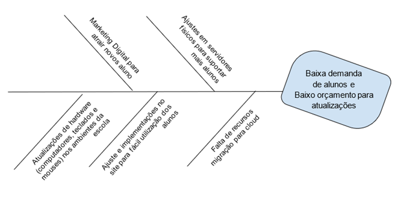

> Atividade contínua de Engenharia de Software

# Sumário
### Atividade Contínua 1
1. [Descrição Do Projeto](#descrição-do-projeto)
2. [Escopo](#escopo)
3. [Requisitos De Alto Nível](#requisitos-de-alto-nível)
4. [Resultados Esperados](#resultados-esperados)
5. [Partes Afetadas](#partes-afetadas)
6. [Integrantes Do Projeto](#integrantes-do-projeto)
7. [Regras De Comunicação](#regras-de-comunicação)
8. [Glossário](#glossário)
9. [Referências](#referências)
10. [Lista De Necessidades](#lista-de-necessidades)
### Atividade Contínua 2
11. [Declaração do Problema](#declaração-do-problema)
12. [Análise Das Causas Raízes](#análise-das-causas-raízes)
13. [Usuários e Outros Stakeholders](#usuários-e-outros-stakeholders)
14. [Fronteira Sistêmica](#fronteira-sistêmica)
### Atividade Contínua 3
15. [Lista de Restrições](#lista-de-restrições)
16. [Lista de Características](#lista-de-características)
17. [Lista de características (Prioridade x Esforço x Risco x Baseline)](#lista-de-características-prioridade-x-esforço-x-risco-x-baseline)
18. [Matriz de Rastreabilidade](#matriz-de-rastreabilidade-necessidades-x-características)

[AC1]: (Atividade_Contínua_01)
## Descrição Do Projeto
A Embromation foi fundada em setembro de 2018. É uma instituição focada no ensino da língua inglesa, que possui sede na Avenida Paulista, São Paulo, SP. 

Este projeto surgiu da necessidade de atualizações tecnológicas, visto que a instituição ainda utiliza *Windows 7* em seus computadores de unidades físicas e a plataforma online está desatualizada e instável. A empresa necessita de melhorias que permitirão a ampliação do negócio. Este projeto visa permitir a continuidade e competitividade da empresa.

## Escopo
A empresa está com baixo número de alunos, portanto o orçamento é baixo e as atualizações serão feitas de forma gradual. Serão atualizados metade dos computadores das unidades presenciais e o foco será nas plataformas online, onde há crescente demanda.
- O novo Sistema Operacional dos computadores será o *Microsoft Windows 10*.
- A plataforma online utiliza *PHP*, será substituída por *HTML, CSS e JavaScript*, para melhorar a experiência dos usuários e a interface do site, tornando-a mais convidativa.

## Requisitos De Alto Nível
#### O novo sistema deve incluir:

- Capacidade de permitir que os alunos acessem a plataforma sem baixar nenhum software e sem precisar de um computador
- Utilização do banco de dados já existente
- Capacidade de incorporar melhorias com base nas regras de negócio

## Resultados Esperados
- Aumento no número de alunos
- Melhora na experiência presencial
- Melhora na experiência de uso da plataforma online
- Por meio das novas tecnologias, a empresa conseguir oferecer um melhor suporte aos alunos

## Partes Afetadas
- **Servidores:** A empresa não possui recurso suficiente para migrar para cloud, então serão feitos ajustes nos servidores físicos
- **Online:** O site deverá ficar offline para implementação das novas tecnologias
- **Presencial:** A instituição deverá ser fechada no período de um mês, para as adequações físicas

## Integrantes Do Projeto
`Cliente:` Embromation LTDA

`Contratada:` Despertar Tecnologia - Soluções em tecnologia empresarial SA
#### Equipe Responsável
- Davi Martins Braga
  > **RA:** 2301642 | **E-mail:** davi.braga@aluno.faculdadeimpacta.com.br
- Marcio Rogerio Leme Zulin
  > **RA:** 2203393 | **E-mail:** marcio.zulin@aluno.faculdadeimpacta.com.br
- Felipe Vilaça Da Silva
  > **RA:** 2301771 | **E-mail:** felipe.vilaca@aluno.faculdadeimpacta.com.br
- Giovanni Aprile De Andrade
  > **RA:** 2202298 | **E-mail:** giovanni.andrade@aluno.faculdadeimpacta.com.br
- Lucas Alves Mota Folli
  > **RA:** 2203210 | **E-mail:** lucas.folli@aluno.faculdadeimpacta.com.br

## Regras de comunicação
- Reuniões online para alinhamento a cada 3 dias
- Visita in loco para inspeção semanal
- Dúvidas de projeto via e-mail
- Chamadas via aplicativo *Teams* da *Microsoft*

## Glossário
| Termo, conceito ou abreviação | Definição |
| ------------- | ------------- |
| Sistema Operacional | Software, ou um conjunto de softwares, que tem como papel gerenciar e administrar todos os recursos presentes em um sistema. Isso envolve desde os componentes do hardware e sistemas de arquivos até programas de terceiros, ele conversa diretamente com o hardware da sua máquina. Exemplos de sistemas operacionais:  Linux, Windows, Android, macOS, UNIX |
| HTML/CSS | HTML é a linguagem de marcação utilizada para estruturar os elementos de uma página web, como parágrafos, links, títulos, tabelas, imagens e até vídeos. Já o CSS é uma linguagem de estilos, utilizada para definir cores, fontes, tamanhos, posicionamento e qualquer outro valor estético para os elementos da página. |
| Windows (versões) | Sistema operacional de interface gráfica multitarefa. Isso significa que podemos trabalhar com vários programas simultaneamente. Por exemplo poderíamos escutar um CD colocado no CD-ROM enquanto escrevemos um documento, imprimimos um outro e recebemos um fax, todos ao mesmo tempo. |
| JavaScript | Linguagem de programação moderna usada por desenvolvedores para fazer páginas interativas da Internet |
| PHP | Linguagem de programação voltada para o desenvolvimento de aplicações para a web e para criar sites, favorecendo a conexão entre os servidores e a interface do usuário. |
| Servidor | Um servidor é um supercomputador, com alto poder computacional, configurado com um ou mais processadores, enorme quantidade de memória RAM, portas para comunicação e algum sistema para armazenamento de dados (HDD ou SSD) internos. |

## Referências
| Informações | |
| ------------- | ------------- |
| Site da escola de idiomas Embromation | http://www.embromation.com.br |
| Rede social da Embromation | https://pt-br.facebook.com/embromation |

## Lista De Necessidades
1. Reestruturação interna dos ambientes de sala de aula para instalação dos novos computadores
2. Atualização do Sistema Operacional dos computadores já existentes que serão mantidos
3. Reconstrução e substituição da plataforma online
4. Atualização e aumento de capacidade do servidor

[AC2]: (Atividade_Contínua_02)
## Declaração do problema
O problema de falta de alunos, de sistemas e equipamentos antiquados afeta a qualidade de ensino dos alunos
e confiabilidade da empresa no mercado devido a baixo orçamento e poucas oportunidades para promover
atualizações dentro da empresa.

Os benefícios dessa atualização são:
- Aumento do número de alunos;
- Melhor experiência presencial e da plataforma online;
- Por meio de novas tecnologias, disponibilizar melhor suporte aos alunos.

## Análise Das Causas Raízes

  
## Usuários e Outros Stakeholders
| Usuários | Descrição |
| ------------- | ------------- |
| Alunos da Embromation | Os alunos são os principais usuários da plataforma online atualizada. Eles acessam o site para obter informações sobre os cursos oferecidos, matricular-se em cursos, pagar suas mensalidades e acessar materiais de aprendizado online. Os alunos também usam os computadores nas unidades físicas da Embromation para assistir aulas e realizar atividades escolares. |
| Professores da Embromation | Os professores usam os computadores da Embromation para preparar suas aulas, acessar o sistema de gerenciamento de aprendizado e interagir com os alunos por meio da plataforma online. Eles também são afetados pelas atualizações na infraestrutura de sala de aula. |
| Funcionários Administrativos da Embromation | Os funcionários administrativos usam os computadores para gerenciar as finanças da escola, manter registros de alunos e funcionários, gerenciar a infraestrutura física da escola e gerenciar o site. |

| Outros Stakeholders | Descrição |
| ------------- | ------------- |
| Despertar Tecnologia, Soluções em tecnologia empresarial SA | A empresa contratada para atualizar a infraestrutura de TI da Embromation é um stakeholder importante. Eles são responsáveis por desenvolver e implementar as novas tecnologias necessárias para melhorar a experiência dos usuários. |
| Clientes em potencial | As atualizações na plataforma online podem atrair novos clientes para a Embromation. Os clientes em potencial podem visitar o site para obter informações sobre cursos oferecidos e decidir se desejam se inscrever. |
| Fornecedores | Os fornecedores da Embromation, como fabricantes de hardware e software, são afetados pelas atualizações na infraestrutura de TI. Eles podem precisar fornecer suporte técnico ou serviços adicionais para garantir a compatibilidade dos seus produtos com a nova infraestrutura. |
| Concorrentes | Os concorrentes da Embromation são afetados pelas atualizações do projeto, pois podem precisar atualizar sua própria infraestrutura de TI para manter a competitividade no mercado. |

## Fronteira Sistêmica

## Lista de Restrições
| Restrição | Razão (Lógica) |
| ------------- | ------------- |
| O Sistema Operacional | Microsoft Windows é o sistema operacional utilizado pela escola |
| Servidores físicos    | A escola depende do servidor físico em funcionamento sempre |
| O Site da Escola      | É o site que fornece boa parte dos conteúdos interativos online síncronos e assíncronos |
| Computadores com i5 ou superior e SSDs com 256GB ou superior | Para fornecer agilidade ao acessar a plataforma e consumo dos vídeos interativos dentro dela |

## Lista de Características
| Característica | Descrição |
| ------------- | ------------- |
| Acesso a materiais de estudo | Através da aplicação, os alunos poderiam ter acesso a materiais de estudo, como apostilas, vídeos, exercícios e outros recursos educacionais, auxiliando em seu aprendizado. |
| Acesso às aulas gravadas | A aplicação vai disponibilizar gravações das aulas ministradas ao vivo, permitindo que os alunos revisem o conteúdo quando necessário ou tenham acesso às aulas que perderam. |
| Acompanhamento de progresso acadêmico | Os alunos podem acompanhar seu progresso acadêmico ao longo do tempo, visualizando gráficos, estatísticas e relatórios que mostram seu desempenho em diferentes disciplinas e períodos.|
| Agenda pessoal | Os alunos terão uma agenda pessoal dentro da aplicação, onde poderiam programar compromissos, anotar tarefas e definir lembretes, ajudando a organizar suas atividades acadêmicas. |
| Agendamento de aulas particulares | A aplicação poderia oferecer a funcionalidade de agendamento de aulas particulares, permitindo que os alunos escolham o professor, a disciplina e o horário desejados. |
| Agendamento de tutorias | Os alunos vão poder agendar tutorias individuais com os professores, permitindo um acompanhamento mais personalizado e aprofundado do conteúdo estudado. |
| Avaliação do curso/professor | Os alunos podem avaliar os cursos e os professores através da aplicação, fornecendo feedback e contribuindo para a melhoria contínua da qualidade do ensino. |
| Biblioteca virtual | A aplicação poderia disponibilizar uma biblioteca virtual, onde os alunos teriam acesso a livros digitais, artigos científicos e outros recursos de pesquisa para complementar seus estudos. |
| Calendário acadêmico | A aplicação poderá apresentar um calendário acadêmico, informando datas importantes, como início e término das aulas, provas, feriados e eventos institucionais. |
| Cancelamento de matrícula | Os alunos poderiam solicitar o cancelamento de matrículas através da aplicação, fornecendo as informações necessárias e seguindo os procedimentos estabelecidos pela Embromation. |
| Comunicação com professores | A aplicação poderia fornecer um sistema de mensagens ou chat para facilitar a comunicação entre alunos e professores, permitindo o envio de dúvidas, solicitação de materiais ou esclarecimentos sobre o conteúdo das aulas. |
| Consulta de boletim | Os alunos poderiam consultar seus boletins acadêmicos através da aplicação, visualizando suas notas, frequência e desempenho em cada disciplina. |
| Fórum de discussão | A aplicação fornecerá um fórum de discussão onde os alunos poderiam interagir entre si, compartilhando ideias, tirando dúvidas e discutindo tópicos relacionados aos cursos oferecidos pela Embromation. |
| Matrícula online | Os alunos poderiam efetuar matrículas diretamente pela aplicação, preenchendo formulários e escolhendo os cursos e horários disponíveis. |
| Notificações e lembretes | A aplicação poderá enviar notificações e lembretes aos alunos, informando sobre prazos de entrega de trabalhos, datas de provas, eventos ou quaisquer outras informações relevantes. |
| Personalização do perfil do aluno | A aplicação poderia permitir que os alunos personalizem seus perfis, adicionando informações adicionais, interesses, foto de perfil e outras informações relevantes. |
| Portal de vagas e oportunidades | A Embromation poderia disponibilizar um portal de vagas e oportunidades de trabalho, estágio ou intercâmbio, fornecendo aos alunos acesso a oportunidades profissionais relacionadas aos cursos oferecidos. |
| Provas Online | A aplicação poderia permitir a realização de provas online, proporcionando aos alunos a comodidade de realizar testes e avaliações diretamente pela plataforma, com o sistema de correção automática, fornecendo resultados instantâneos. |
| Recursos de aprendizagem interativos | A aplicação poderia oferecer recursos de aprendizagem interativos, como jogos educacionais, quizzes e atividades interativas, tornando o processo de aprendizado mais dinâmico e envolvente. |
| Suporte técnico online | A aplicação contará com um sistema de suporte técnico online, permitindo que os alunos relatem problemas técnicos, solicitem assistência e recebam orientações para solucionar eventuais dificuldades no uso da plataforma. |
| Transformar salas duplas em únicas | Salas maiores possibilitam a inserção de móveis como mesas e cadeiras, e irão possibilitar a instalação de novos computadores. |
| Microsoft Windows 10 | O *Microsoft Windows 10* possui mais ferramentas e recursos que o *Microsoft Windows 7*, além de segurança aprimorada e possibilidade de melhores integrações com ferramentas direcionadas ao ensino. |
| Servidores físicos | Adição de mais armazenamento e uma manutenção preventiva nos servidores para prevenir a perda de dados e aumentar a confiabilidade no uso. |
| Novos computadores | Será feita a compra de computadores melhores (i5 e SSD) para melhor atender aos alunos. |

## Lista de características (Prioridade x Esforço x Risco x Baseline)

Legendas

  - **\[P]:** **Prioridade definida pelo cliente**
    - **\[C]:** **Crítica** - Sem essa característica o projeto não é possível.
    - **\[I]:** **Importante** - Nessa versão do projeto essa característica não é obrigatória.
    - **\[U]:** **Útil** - Essa característica pode ser útil, mas a falta dela não causa problemas graves.
  
  - **\[E]:** **Esforço necessário definido pela equipe do projeto**
    - **\[A]:** **Alto**
    - **\[M]:** **Médio**
    - **\[B]:** **Baixo**

  - **\[R]:** **Risco da característica não ser implementada dentro do prazo e custo definido**
    - **\[A]:** **Alto**
    - **\[M]:** **Médio**
    - **\[B]:** **Baixo**
  
  - **\[B]:** **Baseline**
    - **\[1]:** **Primeira versão do projeto** - Características críticas, mas pode conter importantes e úteis.
    - **\[2]:** **Segunda versão do projeto** - Características importantes, mas pode conter características úteis.
    - **\[3]:** **Terceira versão do projeto** - Características úteis.
  

| \# | Característica | P | E | R | B |
| :-: | :-: | :-: | :-: | :-: | :-: |
| 1  | Servidores (manutenções) | C | A | B | 1 |
| 2  | Atualização Sistema Operacional | C | M | B | 1 |
| 3  | Consulta de boletim | C | M | A | 1 |
| 4  | Provas online | C | A | A | 1 |
| 5  | Matrícula online | C | A | A | 1 |
| 6  | Comunicação com professores | C | B | M | 1 |
| 7  | Acesso a materiais de estudo | C | M | M | 1 |
| 8  | Calendário acadêmico | C | B | M | 1 |
| 9  | Suporte técnico online | C | M | M | 1 |
| 10 | Acesso a Aulas Gravadas | C | B | M | 1 |
| 11 | Biblioteca Virtual | C | A | B | 1 |
| 12 | Reconstrução salas | C | A | M | 1 |
| 13 | Novos Computadores | U | M | M | 2 |
| 14 | Cancelamento de matrícula | I | A | A | 2 |
| 15 | Agendamento de aulas particulares | U | M | A | 2 |
| 16 | Notificações e lembretes | I | M | M | 2 |
| 17 | Avaliação do curso/professor | U | B | M | 2 |
| 18 | Acompanhamento do Processo Acadêmico | I | A | B | 2 |
| 19 | Fórum de discussão | U | A | M | 2 |
| 20 | Agenda Pessoal | I | B | B | 2 |
| 21 | Recursos de aprendizagem interativos | I | A | B | 2 |
| 22 | Agendamento de tutorias | U | M | A | 2 |
| 23 | Portal de vagas e oportunidades | I | A | M | 2 |
| 24 | Personalização do perfil do aluno | U | B | B | 2 |

## Matriz de Rastreabilidade (Necessidades x Características)
> [Lista De Necessidades](#lista-de-necessidades)

| \# | Característica                           | N1 | N2 | N3 | N4 |
| :-: | :-: | :-: | :-: | :-: | :-: |
| 1  | Acesso a Aulas Gravadas                  |    |    | x  |    |	
| 2  | Acesso a materiais de estudo   				  |    |    | x  |    |
| 3  | Acompanhamento do Processo Acadêmico	    |    |    | x  |    |
| 4  | Agenda Pessoal				                    |    |    | x  |    |
| 5  | Agendamento de aulas particulares 		    |    |    | x  |    |
| 6  | Agendamento de tutorias	                |    |    | x  |    |
| 7  | Atualização Sistema Operacional			    |    | x  |    |    |
| 8  | Avaliação do curso/professor				      |    |    | x  |    |
| 9  | Biblioteca Virtual				                |    |    | x  |    |
| 10 | Calendário acadêmico				              |    |    | x  |    |
| 11 | Cancelamento de matrícula			          |    |    | x  |    |
| 12 | Computadores novos				                | x  |    | x  |    |
| 13 | Comunicação com professores			        |    |    | x  |    |
| 14 | Consulta de boletim				              |    |    | x  |    |
| 15 | Fórum de discussão			                  |    |    | x  |    |
| 16 | Matrícula online				                  |    |    | x  |    |
| 17 | Notificações e lembretes			            |    |    | x  |    |
| 18 | Personalização do perfil do aluno			  |    |    | x  |    |
| 19 | Portal de vagas e oportunidades	        |    |    | x  |    |
| 20 | Provas online			                      |    |    | x  |    |
| 21 | Reconstrução salas				                | x  | x  |    | x  |
| 22 | Recursos de aprendizagem interativos			|    |    | x  |    |
| 23 | Servidores (Capacidade e manutenção)		  |    |    | x  | x  |
| 24 | Suporte técnico online				            |    |    | x  |    |

